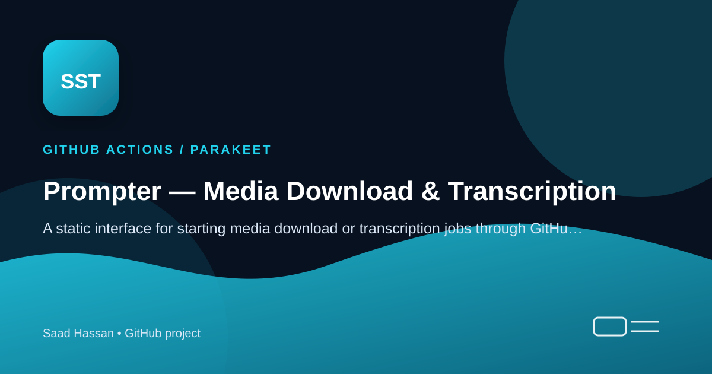

<!-- Project cover -->
<p align="center">
  
</p>

> **GitHub Actions / Parakeet** — A static interface for starting media download or transcription jobs through GitHub Actions.

## Project snapshot

- A Cloudflare Worker protects the GitHub token while releases provide job-status results.
- Includes a root-level <a href="./project-cover.svg">project-cover.svg</a>, a scalable project cover graphic for this repository.

---

# Prompter — download & transcribe media over GitHub Actions

## NVIDIA AI transform tools

The production tools live in `docs/tools/` and are linked from the homepage and
each completed transcript. The implementation uses the PDF and prototype in
`prompter-nvidia-tools/` as references; the prototype remains separate.

Available features:

- Summary, chapters and key moments; transcript and timed-subtitle translation.
- Semantic search and transcript chat with source passages and supplied timestamps.
- Editable content repurposing, JSON meeting/podcast notes, ranked clip suggestions.
- AI caption line segmentation, SRT/VTT exports, translated video caption preview.
- Image descriptions/alt text, sampled video Q&A, and content safety classification.
- Styled captions burned into a downloadable MP4 through the existing Actions queue.

Downloads, Parakeet transcription, diarization, notifications, and existing `?job=`
links continue to use their original routes. The Worker adds `/ai/config`,
`POST /ai/jobs`, and `GET /ai/jobs/<uuid>`. AI calls use persistent SQLite-backed
Durable Objects and alarms, with a 240-second timeout per model attempt, at most
three attempts, scheduled backoff, a restart watchdog, and a 15-minute job window.
NVIDIA HTTP 202 responses are polled by request ID rather than resubmitted.
Refreshing a tab can
resume the saved operation without resubmitting finished batches. Each individual
AI job has a shareable result link that expires after 24 hours.

The API key stays in the Worker's `NVIDIA_API_KEY` secret. The supplied development
key is in the ignored `worker/.dev.vars`; it is never shipped in browser assets.
AI inference has a separate atomic limit of 120 submissions per IP per hour and a
shared budget of 30 NVIDIA requests/minute. Matching results are cached privately
by input hash for 24 hours; malformed structured outputs can bypass this cache on
retry. Requests are validated against a model allowlist, and specialized models
never silently fall back to generic chat models.
Nemotron thinking mode is disabled for these user-facing transforms so structured
caption/notes requests return final answers within their output-token budgets.

Riva's documented language pairs use explicit system tags and English pivoting.
Auto-detection, Urdu, Persian and Malay use the chat model. Riva subtitle batches
use a single line with checked cue markers: a multiline batch dropped a cue in
live testing. Translations preserve original cue boundaries and `Speaker N:` labels.
Plain text has approximate subtitle timing. Long text tools process all supplied
text in parts; they reject inputs above 170,000 characters with a clear message.

Caption exports accept public media links and up to 40 KB of timed SRT, with
classic, bold and minimal styles. Local videos can be previewed, but a remote
export requires a public link. Exported videos and SRT are public release assets,
as with existing jobs. NVIDIA trial processing/recording is disclosed on the page.

Dubbing, audio cleanup and synthetic-video detection need additional NVIDIA
access or separately hosted services; they are explicitly unavailable in the UI.
Pose tracking and live voice remain parked as specified by the PDF.

### Deploy these changes

Deploy the additive Worker before publishing the frontend. The existing GitHub
and Turnstile secrets are preserved by `wrangler deploy`.

```powershell
npm ci
npx wrangler login
npx wrangler secret put NVIDIA_API_KEY --config worker/wrangler.toml
# Paste the NVIDIA key at the prompt; do not put it in a command or public config.
npx wrangler deploy --config worker/wrangler.toml
```

Publish the changed `docs/`, `.github/workflows/process.yml`, and
`scripts/caption.py` together on the default branch using the existing GitHub
Pages deployment. The workflow needs to support the new `captions` dispatch before
using caption exports. No hosting migration is required. If enabling Turnstile,
keep `turnstileSiteKey` in `docs/tools/js/config.js` consistent with the homepage.

### Verify locally

```powershell
npm ci
npm test
npm run check:worker
# Browser checks use Chromium, or installed Microsoft Edge as a fallback.
npx playwright install chromium
# Generate the small video fixture required by browser sampling checks:
New-Item -ItemType Directory -Force .wrangler/test-media | Out-Null
ffmpeg -hide_banner -loglevel error -y -f lavfi -i testsrc=size=160x90:rate=10 -t 1 -pix_fmt yuv420p .wrangler/test-media/sample.mp4
npm run test:browser
```

Optional real endpoint checks require Python `requests` and the ignored local key:
`python tests/nvidia-smoke.py`. To check persistent job execution, run
`npm run dev:worker -- --var ALLOWED_ORIGIN:http://127.0.0.1:8765`, then
`python tests/local-worker-smoke.py` or `node tests/browser-smoke.cjs --live` in
another terminal. Live checks submit only synthetic test content.

Validated on 2026-10-05: 18 Node tests and 3 Python tests, desktop/mobile browser
regressions, actual ffmpeg caption rendering, live summary/translation/embedding/
safety responses, and real browser-to-Worker-to-NVIDIA background execution.
The current Cloudflare login has expired, so this workspace implementation has not
been deployed to the live site.

Paste a video link on a static web page; a remote GitHub Actions runner downloads
the video (at a chosen quality) or transcribes it with **NVIDIA Parakeet TDT**, and
the result comes back to the page. No server of your own beyond a tiny Cloudflare
Worker that keeps your GitHub token safe.

The page follows the visitor's light/dark system theme. While a job runs it shows a
live stage (downloading → transcribing → uploading), and the URL becomes a shareable
`?job=<id>` permalink you can bookmark or send to someone — reopening it re-polls and
shows the result. Failures surface the real reason (private video, unavailable,
members-only, …) rather than a generic error.

## How it works

```
Browser (GitHub Pages)  ──POST /trigger──►  Cloudflare Worker  ──repository_dispatch──►  GitHub Actions
        ▲                                    (holds the token)                                │
        │                                                                                     │ runs yt-dlp / Parakeet
        └──────────GET /status (poll)──────  Worker reads the Release  ◄──uploads asset──  GitHub Release (job-<id>)
```

- The **Worker** is the only thing that talks to the GitHub API. Your token lives
  there as a secret, never in the browser.
- Each job creates a **Release** tagged `job-<id>`. Its notes are the status channel the
  page polls: `status:` is queued (no release) / running / done / error, `stage:` carries
  the live sub-step, and `mode:` lets a shared `?job=` link render without prior context.
  **Done is keyed off `status: done` in the notes, written only after every asset is
  uploaded** — so a poll landing mid-upload never reports a half-finished job.
- On failure, the scripts write a one-line human reason to `ERROR.txt`; the Worker returns
  it as the error message the page shows.
- **Video** comes back as a download link (release asset). **Transcripts** are shown
  inline on the page and offered as `.txt` / `.srt`.

## Transcription & diarization

Transcribe mode always writes `<name>.txt` and `<name>.srt`. Tick **Label speakers** and
it *additionally* writes `<name>.diarized.txt` and `<name>.diarized.srt`, with every turn
prefixed `Speaker 1:` / `Speaker 2:` / …

- **The speaker count is required in the UI** (1–20). An exact count is noticeably more
  accurate than auto-detection. `transcribe.py` still accepts `--speakers 0` to
  auto-detect for local runs, tuned with `--cluster-threshold`.
- **The plain transcript is written before diarization starts**, so a diarization failure
  can't cost you the transcript.
- **Speaker numbers are arbitrary and per-file.** Diarization works out how many voices
  there are and when each is speaking — not who they are. "Speaker 1" in two different
  jobs is not the same person.
- **Expect roughly double the job time**: a segmentation pass, embedding extraction and
  clustering on top of transcription, on 2–4 vCPUs.
- **Overlapping speech is the weak spot** of any clustering diarizer — expect smearing
  where people talk over each other.
- Models are pyannote segmentation 3.0 (~7 MB) plus NeMo TitaNet-small embeddings
  (~40 MB), pulled from sherpa-onnx's GitHub releases — no Hugging Face token and no
  PyTorch. Cached in `models/` (gitignored) and cached in CI under its own key.

## Repo layout

```
.github/workflows/process.yml   the Actions job (download + transcribe)
scripts/fetch.py                yt-dlp download (video preset or audio-only)
scripts/transcribe.py           Parakeet TDT + Silero VAD -> .txt / .srt
requirements.txt                transcription deps (CPU)
worker/worker.js                Cloudflare Worker (the secure relay)
worker/wrangler.toml            Worker config
docs/index.html                 the GitHub Pages frontend
```

## Setup

### 1. Create the repo
Create a **public** repo and add these files. Everything runs from the **default
branch** — `repository_dispatch` only triggers workflows on the default branch, so the
workflow file must live there.

### 2. Enable GitHub Pages
Settings → Pages → Build and deployment → Deploy from a branch → branch `main`, folder
`/docs`. Note the published URL, e.g. `https://USERNAME.github.io/REPO/`. The origin
you'll need later is just `https://USERNAME.github.io`.

### 3. Create a token for the Worker
Create a **fine-grained personal access token** (Settings → Developer settings →
Fine-grained tokens):
- Repository access: only this repo.
- Permissions: **Contents → Read and write** (this one permission covers both firing
  `repository_dispatch` and reading releases).

The workflow itself does **not** need this token — it uses the built-in `GITHUB_TOKEN`.
The PAT is only for the Worker.

### 4. Deploy the Worker
```bash
npm install -g wrangler
cd worker

# edit wrangler.toml: set GITHUB_OWNER, GITHUB_REPO, ALLOWED_ORIGIN
wrangler login
wrangler secret put GITHUB_TOKEN      # paste the fine-grained PAT
wrangler deploy
```
Copy the deployed URL (e.g. `https://yt-actions-relay.<subdomain>.workers.dev`).

### 5. Point the frontend at the Worker
In `docs/index.html`, edit the CONFIG block near the bottom:
```js
const WORKER_URL = "https://yt-actions-relay.<subdomain>.workers.dev";
const REPO_URL   = "https://github.com/USERNAME/REPO";
```
Commit. Once Pages redeploys, open the Pages URL and try a link.

## Optional hardening (recommended for anything public)

### Bot check (Cloudflare Turnstile)
1. Create a Turnstile widget (free) and note the **site key** and **secret key**.
2. Put the site key in `docs/index.html` → `TURNSTILE_SITE_KEY`.
3. Set the secret on the Worker: `wrangler secret put TURNSTILE_SECRET`, then `wrangler deploy`.

Keep these consistent: only set the Worker secret **if** the frontend has a site key.
(Secret set but no site key ⇒ every request fails verification.)

### Per-IP rate limit — **already on in this repo**
The `RATE_LIMIT` KV namespace is created and bound in `worker/wrangler.toml`, capped by
`RATE_LIMIT_PER_HOUR` (currently 10). Setting it up from scratch elsewhere:
```bash
cd worker
wrangler kv namespace create RATE_LIMIT   # copy the id it prints
# paste the id into the [[kv_namespaces]] block in wrangler.toml
wrangler deploy                           # the cap is not live until you deploy
```
The Worker skips rate limiting entirely when the binding is absent, so deleting that
block silently reopens the hole rather than failing loudly.

**Caveat:** KV reads are eventually consistent (~60s), so this caps sustained abuse, not
a parallel burst — several simultaneous requests can each read a stale count and pass.
For a hard cap, switch to Cloudflare's native rate-limiting binding, which is atomic.

### Release cleanup
`.github/workflows/cleanup.yml` deletes `job-*` releases (and their tags) older than 3
days, nightly. Run it manually from the Actions tab with `dry_run` first to preview.
Keep retention above `process.yml`'s 350-minute timeout so it can't delete a release
belonging to a job that is still running.

## Costs & limits
- **Free** on a public repo (unlimited Actions minutes on standard runners).
- Runners are ~2 vCPU, so transcription runs slower than your laptop — still far under
  the **6-hour per-job cap**. Parakeet at ~0.3–0.5 RTF on a runner means an hour of
  audio in well under an hour.
- GitHub allows ~20 concurrent jobs on free public repos — a natural throttle.

## YouTube is not supported

YouTube blocks the datacenter IP ranges GitHub Actions runners come from ("Sign in to
confirm you're not a bot"). Both the frontend and the Worker reject YouTube links up
front with an explanation, instead of queueing a job that can only fail.

**Don't try to fix this with cookies, PO tokens, or `player_client` tricks.** They buy
account access and bot attestation — not IP reputation. yt-dlp's maintainers file the
logged-out datacenter-IP block under *intractable issues* and state that a PO token will
not help if your IP is already blocked. Account cookies additionally stop working within
days and carry a real risk of the account being banned, so they cannot run unattended.
This was researched and settled; the scaffolding in `fetch.py` predates that finding.

The only lever that changes the outcome is not using a datacenter IP — a self-hosted
runner on a residential connection, or a residential proxy via `YTDLP_PROXY`. Both were
considered and declined: the runner would execute strangers' URLs on a home network, and
a metered proxy lets anyone run up an unbounded bill on a free public tool.

## Optional yt-dlp network config

`process.yml` reads three optional settings and no-ops when they're unset:

| Name | Kind | Purpose |
|---|---|---|
| `YT_COOKIES_B64` | secret | base64 of a Netscape `cookies.txt`, for age-restricted or private content **on sites other than YouTube** |
| `YTDLP_PROXY` | secret | proxy URL (may embed credentials) |
| `YTDLP_PLAYER_CLIENT` | variable | comma-separated yt-dlp player clients |

The cookies file is written to `$RUNNER_TEMP`, never the workspace — anything under
`output/` is swept up by `gh release upload output/*` and would be published.

## Notes
- **Keep yt-dlp current.** The workflow installs the latest each run; most "can't
  download" errors are stale-extractor issues fixed by updating.
- **Quality presets** (best / 1080p / 720p / 480p / 360p) are fixed for v1; yt-dlp picks
  the closest match. Per-video format listing can be added later.
- Test the transcription logic locally first with the companion notebook before relying
  on it in Actions.
